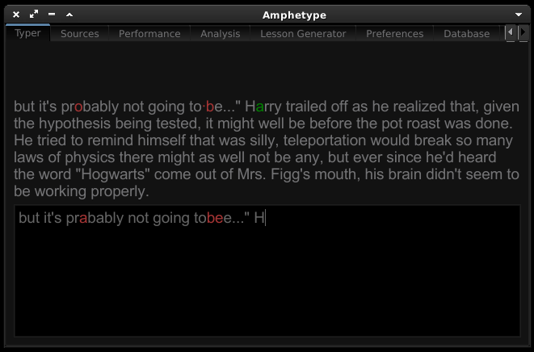

# Amphetype (lalop edition)

[Amphetype](https://code.google.com/p/amphetype/) is a layout-agnostic typing program that lets you import your own texts. This allows you to "read" while practicing typing at the same time.

However, though it is a generally solid tool, vanilla Amphetype lacks several interactivity options & important features. This fork aims to add some of them.

### Forked Features include:

1. Unicode -> Ascii transliteration to avoid "untypable characters", as well as some replacements of bad formatting, either via unidecode and/or manually (see Text.py)

2. Letter coloring, both in input and displayed text, based on current positions and errors

3. Invisible Mode: Makes input text invisible (for use with #2)

4. Toggle case sensitivity

5. Option for continuing to the next passage even with typing mistakes

6. Option for automatically inserting space, newline, and other custom keys 

7. Option to count adjacent errors as only one error

8. Option for preventing continuing to the next word until space correctly pressed

9. Extensive GUI Color Settings

10. Can change return and space characters

11. Allows for smaller resizing than vanilla Amphetype

### Warning about databases/statistics: 

The database/statistics of this fork should be considered unstable.  In addition, some of the options here (e.g. counting or not counting adjacent errors) can significantly change the resulting statistics. 

It is therefore recommended to use a different database for this fork than with other versions of amphetype, as well as to make regular backups of any important data.

# Example Usage

* You don't want to see your own typing, only your position and any mistakes.  Turn on *Invisible Mode* and customize the *Text Display* settings as desired.

 * You're doing a speed-run and don't even want to see mistakes either (lest they lead to even the slightest hesitation).  Uncheck the *Text Display* setting for showing mistakes as well.

* You only want to type the letters of words.  Set the option to *Automatically Insert* spaces, newlines, and, if desired, other punctuation characters.

* A text uses unusual punctuation that you want to skip, e.g.
 
         ##Hi,## I said, ##How are you today?##

 You can set preferences to *Automatically Insert* \#.

* A text is written in a certain format, whose intricacies you wish to ignore, e.g.

          DIRECTOR: But what can we do? [The DIRECTOR'S stares at the FACT SHEET.]
          
          [Around the room, groans.]
          
          ASSISTANT: I suppose we can [ASSISTANT looks around nervously, seeing 
          the AUDIENCE as well as several CAST MEMBERS] hash it out?

 In this particular case, you can uncheck *Case sensitive* and have [ and ] *Automatically Inserted*.

# License and Disclaimers

Amphetype is free software: you can redistribute it and/or modify
it under the terms of the GNU General Public License as published by
the Free Software Foundation, either version 3 of the License, or
(at your option) any later version.

Amphetype is distributed in the hope that it will be useful,
but WITHOUT ANY WARRANTY; without even the implied warranty of
MERCHANTABILITY or FITNESS FOR A PARTICULAR PURPOSE.  See the
GNU General Public License for more details.

You should have received a copy of the GNU General Public License
along with Amphetype.  If not, see <http://www.gnu.org/licenses/>.

THIS SOFTWARE, ANY ASSOCIATED FILES, AND ANY ASSOCIATED DOCUMENTATION
ARE PROVIDED BY THE COPYRIGHT HOLDERS AND CONTRIBUTORS "AS IS", WITHOUT
WARRANTY OF ANY KIND, EXPRESS OR IMPLIED, INCLUDING BUT NOT LIMITED TO
THE WARRANTIES OF MERCHANTABILITY, FITNESS FOR A PARTICULAR PURPOSE AND
NONINFRINGEMENT. IN NO EVENT SHALL THE COPYRIGHT OWNER OR CONTRIBUTORS
BE LIABLE FOR ANY DIRECT, INDIRECT, INCIDENTAL, SPECIAL, EXEMPLARY, OR
CONSEQUENTIAL DAMAGES (INCLUDING, BUT NOT LIMITED TO, PROCUREMENT OF
SUBSTITUTE GOODS OR SERVICES; LOSS OF USE, DATA, OR PROFITS; OR BUSINESS
INTERRUPTION) HOWEVER CAUSED AND ON ANY THEORY OF LIABILITY, WHETHER IN
CONTRACT, STRICT LIABILITY, OR TORT (INCLUDING NEGLIGENCE OR OTHERWISE)
ARISING IN ANY WAY OUT OF THE USE OF THIS SOFTWARE, ANY ASSOCIATED FILES,
OR ANY ASSOCIATED DOCUMENTATION, EVEN IF ADVISED OF THE POSSIBILITY OF
SUCH DAMAGE.

# Original

Proper install is coming. I apologize for the current
mess. It was developed on a Windows machine with few
tools and no internet during a train ride and suffered
a few rewrites so the filenames aren't very descriptive
anymore.

To run, type:

python Amphetype.py

Depends on:

python-qt4  (that is, PyQt 4.3+)

OPTIONAL:

unidecode from https://pypi.python.org/pypi/Unidecode/
 - Will attempt to transliterate unicode -> ascii using this,
 if available. The default methods are mostly manual 
 (see: unicode_replacements in Text.py) and probably not as 
 effective.

py-editdist from http://www.mindrot.org/projects/py-editdist/
 - This latter dependancy is by no means critical and you will
 probably never get to use it. (For fetching words from a wordfile
 that are "similar" to your target words in the lesson generator.)
 If you don't have the module it will just select random words
 instead

