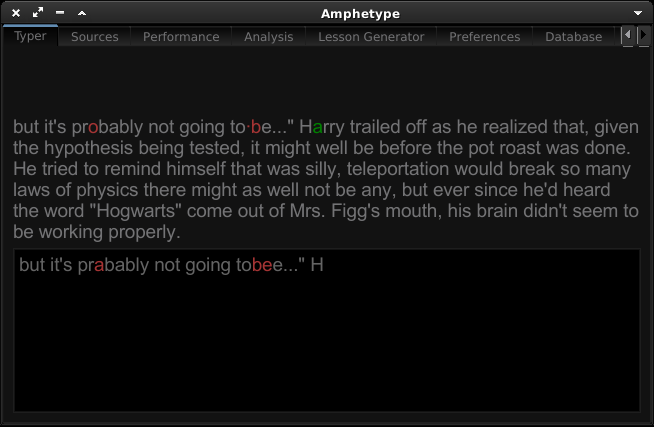

My Fork of Amphetype - A great typing program.
It contains a bunch of small improvements that I needed to use it.

This is my personal fork of https://code.google.com/p/amphetype/

Differences include:

These include:
 * Unicode -> Ascii transliteration to avoid "untypable characters", as well as some replacements of bad formatting, either via unidecode and/or manually (see Text.py)
 * Phrase based lesson
 * Forced addition of capitals and symbols to words ( to strength training of these if so desired)
 * Letter coloring, both in input and displayed text, based on current positions and errors
 * Individual letter coloring, both in input and displayed text, based on current positions and errors
 * improved lesson splitter
 * Option for continuing to the next passage even with typing mistakes
 * permissive mode
 * Invisible Mode: Makes input text invisible (goes well with #2)
 * Option for preventing continuing to the next word until space correctly pressed
 * Allows continuation even with typing errors
 * Dark Theme
 * etc
 * Extensive GUI Color Settings
 * Can change return and space characters
 * Allows for smaller resizing than vanilla Amphetype

Todo:

1. Refactor so that data analysis is separate from GUI classes

License and Disclaimers

Amphetype is free software: you can redistribute it and/or modify
it under the terms of the GNU General Public License as published by
the Free Software Foundation, either version 3 of the License, or
(at your option) any later version.

Amphetype is distributed in the hope that it will be useful,
but WITHOUT ANY WARRANTY; without even the implied warranty of
MERCHANTABILITY or FITNESS FOR A PARTICULAR PURPOSE.  See the
GNU General Public License for more details.

You should have received a copy of the GNU General Public License
along with Amphetype.  If not, see <http://www.gnu.org/licenses/>.

Sample text included:
 * Selections from project gutenberg
 * All the typing tests from TyperRacer.com
 * QWERTY right hand / Left Hand and alternating hand words

To run, type:

python Amphetype.py

Depends on:

python-qt4  (that is, PyQt 4.3+)

OPTIONAL:

unidecode from https://pypi.python.org/pypi/Unidecode/
 - Will attempt to transliterate unicode -> ascii using this,
 if available. The default methods are mostly manual 
 (see: unicode_replacements in Text.py) and probably not as 
 effective.

py-editdist from http://www.mindrot.org/projects/py-editdist/
 - This latter dependancy is by no means critical and you will
 probably never get to use it. (For fetching words from a wordfile
 that are "similar" to your target words in the lesson generator.)
 If you don't have the module it will just select random words
 instead
